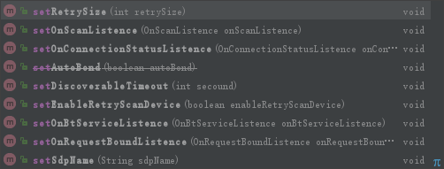

#### 适用于多个蓝牙设备之间链接通讯，基于ACL的UUID模式  
### in gradle
```
allprojects {
    repositories {
        ...
        maven { url 'https://jitpack.io' }
    }
}

dependencies {
        implementation 'com.github.15875641474:hzc.bluetooth.acl:1.0.0'
}
```

### in use
使用前先初始化`HzcBluetoothAclService.getInstance().init(Activity);`

#### 创建蓝牙集群服务
```
//创建服务
HzcBluetoothAclService.getInstance().startBtConnectonService(String serviceName);
```

#### 链接设备
```
//搜索蓝牙设备
HzcBluetoothAclService.getInstance().doScanBtDevice();
//链接
HzcBluetoothAclService.getInstance().doConnection(BluetoothDevice,OnConnectionServiceListence);
//关闭链接
HzcBluetoothAclService.getInstance().closeConnection(BluetoothSocket);
```
服务端以及客户端的通讯也就使用这几个API。  
这里并没有实现消息通讯，因为考虑到每个同学在通讯层面的设计模式都可能不相同，所以这里只给出基本服务，在获得`BluetoothSocket`和`BluetoothDevice`后,同学可按照自己的socket层通讯协议自行操作，这里就不画蛇添足了。  
至于一些事件监听，例如蓝牙状态监听，客户端接入监听，服务端链接监听，链接成功失败，搜索状态等等均可进行事件设置，有如下API
### API



### 更多请查看源码或者demo